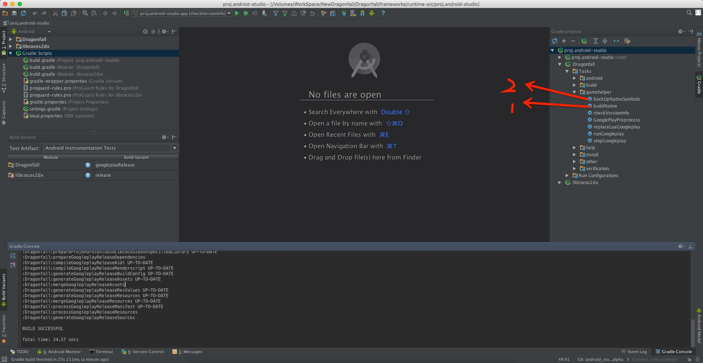

# Android Studio开发

	我们Andorid项目现在只能在mac上使用AS(Android Studio)开发项目
	项目不支持同时构建debug和release版本,但支持同一版本下的不同apk构建

## 安装部分

1. 安装`jdk 1.7`.找到JDK的绝对路径,如:`/Library/Java/JavaVirtualMachines/jdk1.7.0_80.jdk/Contents/Home`

2. 安装`AS`及最新的`Andorid SDK`. 从 [http://developer.android.com/sdk/index.html](http://developer.android.com/sdk/index.html) 下载最新版本的AS,安装`Android SDK`,`我们统一使用Gradle 2.8作为构建脚本的版本`,**第一次使用gradlew命令或导入AS可能会很慢,因为会自动从网上下载gradle 2.8**

3. 安装`Android NDK`.由于 cocos2d-x 还不支持最新的 NDK r10，所以我们需要从网络上搜索 NDK r9d 下载用于编译.下载解压缩,不能放在包含中文和空格的目录中.
	~~~
		如果需要使用cocos2d-x官方提供的编译脚本编译android上的第三方库
		cocos2d-x官方提供的编译脚本需要使用NDK r10版本，具体查看它的说明文件
	~~~
4. 安装Ant. 从 [http://ant.apache.org](http://ant.apache.org) 下载最新版本的Ant 执行文件.下载解压缩,不能放在包含中文和空格的目录中.

5. 关于Android SDK,可以通过AS自动下载，也可以提前下载好后在环境变量中配置,下面的例子是先安装好了Android SDK进行的配置

## 配置工作

-   Mac 下修改环境变量：

    编辑`~/.zshrc`或者`~/.profile`文件
    
    添加以下代码：

    ~~~
    #Android Developer
    export JAVA_HOME=JDK绝对路径
    export ANT_HOME=ANT根目录绝对路径
    export ANDROID_NDK_ROOT=NDK根目录绝对路径
    export ANDROID_SDK_ROOT=SDK根目录绝对路径
    
    #2dx console part
    export NDK_ROOT=${ANDROID_NDK_ROOT}
    export ANT_ROOT=${ANT_HOME}/bin
    export ANDROID_HOME=${ANDROID_SDK_ROOT}   
    
    export PATH=$PATH:${ANDROID_NDK_ROOT}:${ANT_ROOT}:${ANDROID_SDK_ROOT}:${ANDROID_SDK_ROOT}/tools:${ANDROID_SDK_ROOT}/platform-tools
    ~~~

    例如：

    ~~~
    #Android Developer
    export JAVA_HOME=/Library/Java/JavaVirtualMachines/jdk1.7.0_80.jdk/Contents/Home
    export ANT_HOME=/Users/dannyhe/WorkSpace/Android/sdk/apache-ant-1.9.6
    export ANDROID_NDK_ROOT=/Users/dannyhe/WorkSpace/Android/sdk/android-ndk-r9d
    export ANDROID_SDK_ROOT=/Users/dannyhe/WorkSpace/Android/sdk/android-sdk-macosx
    
    #2dx console part
    export NDK_ROOT=${ANDROID_NDK_ROOT}
    export ANT_ROOT=${ANT_HOME}/bin
    export ANDROID_HOME=${ANDROID_SDK_ROOT}   

    export PATH=$PATH:${ANDROID_NDK_ROOT}:${ANT_ROOT}:${ANDROID_SDK_ROOT}:${ANDROID_SDK_ROOT}/tools:${ANDROID_SDK_ROOT}/platform-tools
    ~~~

- 验证开发环境  

  完全退出所有终端,重新打开一个终端，分别验证下面的命令是否可以执行.
  * android
  * adb 
  * ant
  * monitor
  
  `如果失败，请仔细检查 SDK/NDK 的版本、安装路径.`

- SDK配置

    终端执行`android`命令,对 Adnroid SDK 进行更新.安装最新的SDK和开发工具

- Android配置文件
  
  创建文件`local.properties`,添加以下代码:
  
  ~~~
  # This file is automatically generated by Android Tools.
  # Do not modify this file -- YOUR CHANGES WILL BE ERASED!
  #
  # This file must *NOT* be checked into Version Control Systems,
  # as it contains information specific to your local configuration.

  # location of the SDK. This is only used by Ant
  # For customization when using a Version Control System, please read the
  # header note.
  sdk.dir=SDK根目录绝对路径
  ndk.dir=NDK根目录绝对路径
  ~~~
  
  例如：

  Mac
  ~~~
  # This file is automatically generated by Android Tools.
  # Do not modify this file -- YOUR CHANGES WILL BE ERASED!
  #
  # This file must *NOT* be checked into Version Control Systems,
  # as it contains information specific to your local configuration.

  # location of the SDK. This is only used by Ant
  # For customization when using a Version Control System, please read the
  # header note.
  sdk.dir=/Volumes/WorkSpace/Android/sdk/android-sdk-macosx
  ndk.dir=/Users/dannyhe/WorkSpace/Android/sdk/android-ndk-r9d
  ~~~
 

  复制`local.properties`到以下路径:
  
  * Dragonfall/frameworks/runtime-src/proj.android-studio
  
### 将项目导入 AS

启动AS后，导入我们的项目`Dragonfall/frameworks/runtime-src/proj.android-studio`

### 设置 Android 设备允许真机调试 

Android 官方文档：http://developer.android.com/tools/device.html

1.  Enable USB debugging on your device.

    -   On most devices running Android 3.2 or older, you can find the option under Settings > Applications > Development.
    -   On Android 4.0 and newer, it’s in Settings > Developer options.

        Note: On Android 4.2 and newer, Developer options is hidden by default. To make it available, go to Settings > About phone and tap Build number seven times. Return to the previous screen to find Developer options.
    
    -   在系统设置中找到“开发者选项”，打开“USB调试”.Android 4.2 开始，`开发者选项`默认是隐藏的，需要打开`设置->关于`界面，然后在`Build Number`上点击七次才能打开`开发者选项`.

2.  Set up your system to detect your device.

    -   If you’re developing on Windows, you need to install a USB driver for adb. For an installation guide and links to OEM drivers, see the OEM USB Drivers document.

    -   根据不同的机型，也许需要安装该机型特定的 USB 驱动程序.例如 Moto 就必须安装 Moto 的 USB 驱动.

3.  Connect your device.
    
    完成设置后，将设备连接到开发机，并解锁设备.

### 构建Andoird项目 

1. 首先我们需要构建和打包我们的资源.
   
	* 构建游戏资源我们使用`python脚本`进行,和`iOS`一样,只是选择`Android`就可
    
    * Android上需要多执行一个脚本:`create_android_zip.py`来将update_android下的文件打包
     
2. 构建我们项目的cpp部分.

	* 使用`Gradle`命令行构建,进入目录`Dragonfall/frameworks/runtime-src/proj.android-studio`,`gradlew`为`Gradle`的包裹工具
	
	   ~~~
	   ./gradlew buildNative backUpNativeSymbols
	   ~~~
   		
	* 使用AS进行构建,先后双击我们自定义的两个任务`buildNative`和`backUpNativeSymbols`执行即可
	      
	   
3. 构建`apk`

	* 使用`Gradle`构建`apk`包,最终生成的`apk`在`Dragonfall/frameworks/runtime-src/proj.android-studio/app/build/outputs/apk`目录下
	 
	 ~~~
	 ./gradlew aR
	 ~~~
    
    * 使用`AS`构建
    
### 使用模块化编译缩小 apk 体积（Cpp模块） ###

  从quick 3.5开始,官方不再提供模块化编译的功能，我们项目参考3.3的编译宏定义提供部分模块化编译的功能

> 测试麻烦，我们就不提供具体减少的app体积数据! iOS中将使用新target的方式定义这些宏减少二进制文件的大小！

打开项目中的 `proj.android-studio/app/jni/Application.mk` 文件，然后将不需要的模块值改为 0。

MACRO        | 功能 
------------ | ------------- 
CC_USE_CURL  | 使用 CURL 库提供 HTTP 网络功能。关闭后，assetsmanager等相关功能也会被去掉。quick 在 Android 下使用 Android 系统的 Java 接口提供 HTTP 网络功能，所以 CURL 关闭后仍然可以使用HttpRequest。
CC_USE_NETWORK_SOKET | 网络模块，如 socket 和 websocket 
CC_USE_SIMULATOR | player文件
CC_USE_PHYSICS | 使用box2d物理引擎
CC_USE_SQLITE  | Sqlite 数据库扩展 lsqlite3
CC_USE_3D    | 使用 3D 模块。 包括3D 粒子
CC_USE_CCBUILDER | 使用 Cocos Builder 支持模块。
CC_USE_SPINE | 使用骨骼动画
CC_USE_ETC1_ZLIB | 打开贴图文件的zlib压缩检查功能,用来压缩etc1文件。需要配合自定义的命令行工具CompressETCTexture用。
CC_USE_POMELO_C_LIB | 启用pomelo c版本的客户端支持(android会自动添加引用的pomelo库,iOS则需要手动引入到Xcode)
CC_USE_FACEBOOK | 打开facebook的功能。这个宏不能控制是否编译facebook的库到包中。
CC_USE_SDK_PAYPAL | 打开PayPal支付的sdk功能(Android)
CC_USE_GOOGLE_LOGIN | 打开google账号登录接口的功能(Android)
CC_USE_APPSFLYER | 打开Appsflyer的功能
CC_USE_TAKING_DATA | 打开talkingdata的接口

### Java中的宏定义

  注意:这里的宏和`使用模块化编译缩小 apk 体积`中的宏可能同名,但是这里的宏是定义在`build.gradle`中使用,影响`Java`代码变动。

MACRO        | 功能           | 依赖库 
------------ | ------------- | -------------
CC_USE_TALKING_DATA| 控制java中使用TalkingData的sdk，如果没有定义这个宏，可以移除libso文件下的相关jar文件 | Game_Analytics_SDK_Android_3.2.3.jar
CC_USE_FACEBOOK | 打开facebook的接口 
CC_USE_APPSFLYER | 打开Appsflyer的功能 | AF-Android-SDK-v3.3.0.jar
CC_USE_GOOGLE_PLAY_BILLING_V3 | 打开google play的内购功能和接口 
CC_USE_GOOGLE_LOGIN | 打开使用Google账号登录的接口  
CC_USE_SDK_PAYPAL | 打开Paypal支付的接口 

### Jni和Java中的编写约定

* Java中的打印请使用`DebugUtil`类的静态方法，不使用系统提供的`Log`

* Jni中如果需要打印,请确保release模式下不会打印(使用NDEBUG宏定义打印宏无效)

* 如果是可选功能,在Java中使用宏定义开关。比如上面的`CC_USE_FACEBOOK`

* 在多个apk的情况下(applicationId不一样),我们使用同一个动态库及同一份游戏资源

### 我们项目自定义的Gradle任务

  为了方便我们开发项目,我定义了一些项目的task,分组在`GameHelper`下,可通过命令`gradlew tasks`查看，或者在AS的Gradle视图中查看,**如构建Andoird项目下那张截图。具体的任务可能有变动，以实际命令查看到的任务为准!**

~~~
GameHelper tasks
----------------
backUpNativeSymbols - backup our native symbols to a zip file .
buildNative - build our native code(cpp).
checkVersionInfo - check the project version infomation in version.properties.
cleanNativeSymbols - clean the native symbols.
PreprocessGooglePlay - preprocess java source code for googleplay market.
PreprocessPayPal - preprocess java source code for paypal market.
replaceLuaGoogleplay - replace the Googleplay zip file of lua on device.
replaceLuaPaypal - replace the Paypal zip file of lua on device.
runGoogleplay - run the Googleplay game on device.
runPaypal - run the Paypal game on device.
stopGoogleplay - stop the Googleplay game on device.
stopPaypal - stop the Paypal game on device.
~~~

**backUpNativeSymbols任务用来备份我们的符号文件的,它会打印最后生成的zip文件路径，需要手动拷贝到其他位置,因为备份文件我们不上传到git!**

### 关于项目的依赖库

  AS项目中除了`jar`文件外(Dragonfall/frameworks/runtime-src/proj.android-studio/app/libs下),其他的依赖库gradle会自动从网上下载,具体设置参考gradle的开发文档！