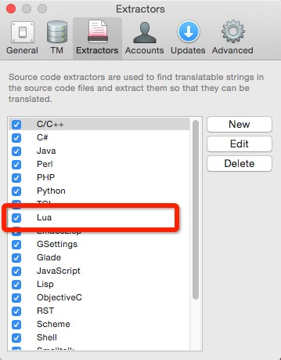
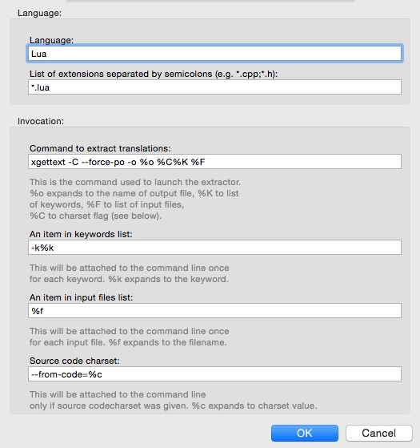
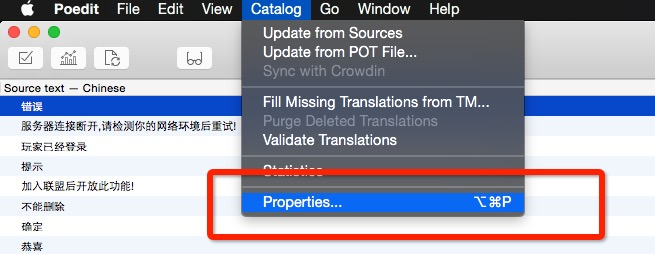
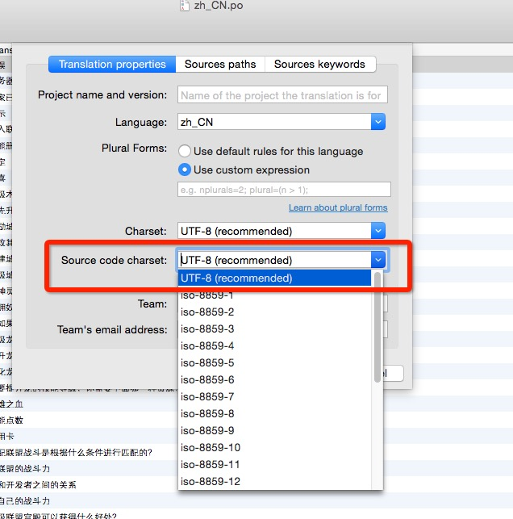
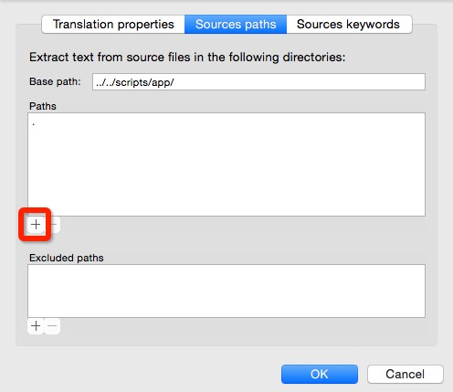
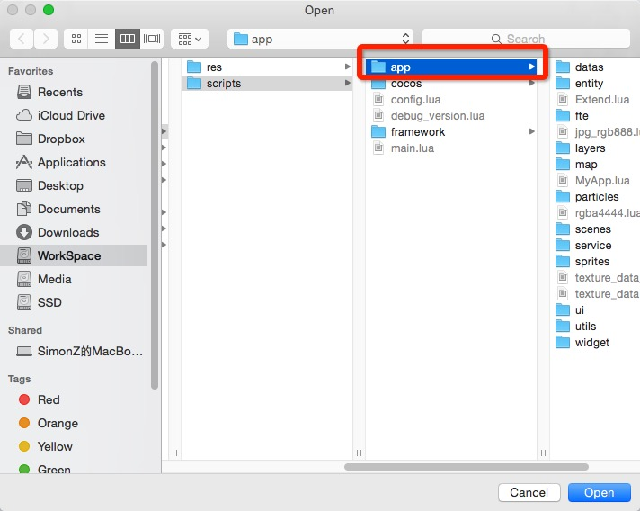
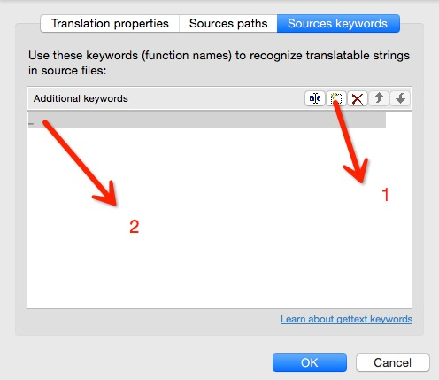
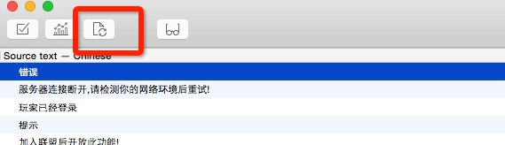

##项目本地化、贴图使用说明文档
#### 本地化说明

1. 安装`poxls-1.1.0.tar.gz`和`poedit_osx.zip`

2. 用poedit更新所有po文件的本地化信息

3. 执行脚本`exportPO2Xlsx.py`将po文件导出为excel

4. excel修改完成后执行脚本`exportXlsx2po.py`将excel导出为最新的po文件

5. 用poedit设置所有po文件(每个po文件都需要设置)的属性(代码编码为utf8,搜索路径为app目录,搜索关键词为下划线，poedit的首选项只需设置一次 [参考文章](http://zengrong.net/post/1986.htm "详细说明")

6. 更新本地化文件

> 如果第6步执行不了，原因就是第5步没有设置好!

**5-6 图解**

******

******

#### 贴图说明

######images下文件夹说明

	_CanCompress: 将被直接压缩为pvrtc4/etc1+alpha/dds的散图
	
	_Compressed: iOS已经被合成最终大图的图
	
	_Compressed_mac: Player已经被合成最终大图的图
	
	_Compressed_wp: Windows Phone下合成的大图
	
	_Compressed_android: Android下合成的大图
	
	rgba444_single: 将被压缩为rgba4444格式的散图
	
######贴图操作说明:

1. 所有的大图项目在`PackImages`文件夹下,TextPacker的项目文件也在里面,使用用脚本`buildTexture.py`导出
2. 所有新加的图需要用`ImageOptim.app`执行一次无损压缩再放入项目中

---
By DannyHe 11/11/2015
