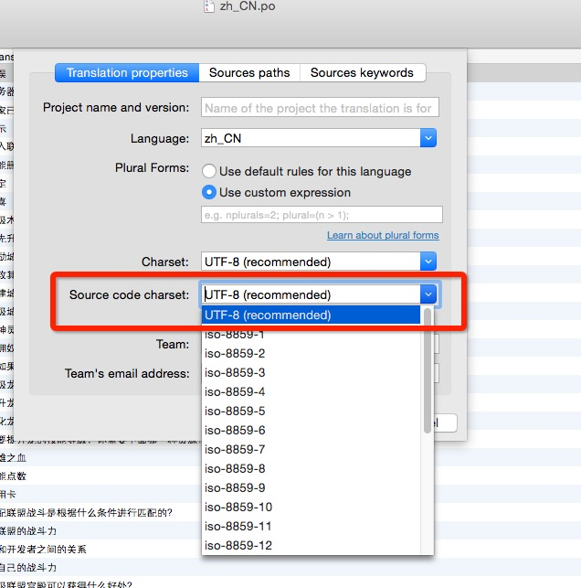

##项目说明文档

#### 开发环境配置

* 安装`TexturePacker`及其命令行工具
* 安装`poedit_osx.zip` 和 `poxls-1.1.0.tar.gz`
* 设置环境变量`RELEASE_GIT_AUTO_UPDATE` 指向自动更新仓库的本地绝对路径(仓库地址:git@github.com:ModunZhang/kod_update_server.git)
* 确保`tools/scripts`下的所有脚本均有执行权限(执行脚本14安装)
* 其他环境(iOS/Android)

#### [脚本文件说明](id:scripts)

> 文件名加粗的脚本不关心,未加粗的才是常用脚本

1. buildGame.sh
	执行lua和资源的导出
	参数:1.平台 2.是否加密lua 3.是否加密资源(执行选择相应参数即可)
	
2. buildLuaConfig.sh
	把excel配置表导出为lua文件
	
3. buildRes.sh
	导出项目的资源
	参数:1.平台 2.是否加密
	
4. buildScripts.sh
	导出项目的lua文件
	参数:1.平台 2.是否加密
	
5. buildUpdate.sh
	发布自动更新脚本,执行选择相应参数即可
	
6. build_format_map.py
	构建图片信息的python实现
7. cleanGame.sh
	清除生成项目的中间文件和update目录
	
8. cleanMacPlayer.sh
	清除保存在player中的userdefault中的信息,不会重置openudid
	
9. cleanTempFile.sh
	清除生成项目的中间文件,但是不会清除update目录
	
10. exportPO2Xlsx.sh
	将项目的本地化po文件导出为excel文件
	参数:1.将要导出的excel文件的路径(xlsx后缀名)
	
11. exportXlsx2po.sh
	将脚本10导出的excel导回项目中
	参数:1.将要导入的excel文件路径(xlsx后缀名)
	
12. export_plist_texture_data.sh
	将合成的大图信息导出到项目中(执行选择相应参数即可)
	
13. **functions.sh**
	为其他脚本提供基础函数的脚本，`如果要改变加密资源和lua的XXTEA信息就修改这个文件中的值`
	
14. install.sh
	为所有的脚本添加执行权限
	
15. **plist_texture_data_to_lua.py**
	脚本12的python实现
	
16. syncUpdateDataToGit.sh
	将生成的update目录上传到相应的git仓库,这个脚本不会自动部署服务器，需要手动ssh到服务器pull版本号使用这个脚本前必须确认全局shell变量`RELEASE_GIT_AUTO_UPDATE`
	
17. buildTexture.sh
    导出游戏的大图到images下，分为player和iOS
    
18. **AndroidXml.py**
    Android读取项目配置文件脚本的pythod实现

19. create_android_zip.sh
    Android下打包资源为zip

20. gcm_push.py
    Android GCM推送测试脚本,用法:
    
    ~~~
    python gcm_push.py --message="Bye Bye" --id="APA91bEv6GmHN3q5Swrsu_Lxxw9zds3Q2C2TPwtWIrBDbouo4uyyE5AdaKxFnZ39FYg0dyJcliPBZa_fqrc5figMZ5-M-gMNfWb_VAm6-HQS1QiDbdyBGTnPysaMw4cBsOGaUkPUbkm_"
    ~~~
        
******

#### 本地化说明

1. 安装`poxls-1.1.0.tar.gz`和`poedit_osx.zip`

2. 用poedit更新所有po文件的本地化信息

3. 执行脚本`exportPO2Xlsx.sh`将po文件导出为excel

4. excel修改完成后执行脚本`exportXlsx2po.sh`将excel导出为最新的po文件

5. 用poedit设置所有po文件(每个po文件都需要设置)的属性(代码编码为utf8,搜索路径为app目录,搜索关键词为下划线，poedit的首选项只需设置一次 [参考文章](http://zengrong.net/post/1986.htm "详细说明")

6. 更新本地化文件

> 如果第6步执行不了，原因就是第5步没有设置好!

**5-6 图解**

******

******

#### 贴图说明

######images下文件夹说明

	_CanCompress:将被直接压缩为pvrtc4的散图
	_Compressed:iOS已经被合成最终大图的图
	_Compressed_mac:Player已经被合成最终大图的图
	rgba444_single:将被压缩为rgba4444格式的散图
	
######贴图操作说明:

1. 所有的大图项目在`PackImages`文件夹下,TextPacker的项目文件也在里面,使用用脚本`buildTexture.sh`导出
2. 所有新加的图需要用`ImageOptim.app`执行一次无损压缩再放入项目中

******

#### Xcode一般调试步骤(Debug)

* 修改项目 关闭Lua中的自动更新逻辑
* `Xcode设置DEBUG为YES.`(AppHoc变量)[^5]
* 如果只修改了Lua,执行脚本4 `buildScripts.sh iOS false`
* 如果只修改了资源,执行脚本3 `buildRes.sh iOS false`
* 如果都有修改执行,执行脚本1 `buildGame.sh iOS false false`
* Xcode执行

******

#### [自动更新说明](id:normal)
###### 自动更新相关注意点
    1.Xcode中Info.plist的版本号设置(`CFBundleShortVersionString`为当前版本号,`AppMinVersion`为支持的最低版本号)，DEBUG的设置(`AppHoc`)
    2.config.lua文件不能被自动更新(cpp写死的)
    3.大版本号和小版本由Xcode中设置的大版本号和小版本号生成json文件
    4.每次发布新ipa包，大版本号必须比线上的高
    5.运行自动更新脚本的时候不要再修改项目的文件!包括其他人此时也不能提交任何东西到git仓库

  举例:手机上此时装的`1.0(123)`[^4]
  
  - 我们发布自动更新`1.0(456)`,最低版本支持为`1.0`[^2],部署到更新服务器,手机直接启动游戏，会走自动更新。[自动更新发布步骤](#ipa0)
 
  - 我们发布新包`1.0(456)`,最低版本支持为`1.0`,部署到更新服务器。`把1.0(456)`的包覆盖安装到手机上(`1.0(123)`)，启动游戏仍然版本会是`1.0(123)`,手机依然会走自动更新流程。
  
  - 我们发布新包`1.0(456)`,最低版本支持为`1.0`,部署更新服务器。手机上删除`1.0(123)`这个包，把`1.0(456)`的包安装新手机上，启动游戏不会走自动更新流程。
    
  - 我们发布新包`1.1(456)`,最低版本支持为`1.1`,部署到更新服务器,如果覆盖安装到手机上,启动游戏版本会是`1.1(456)`不会走自动更新。如果我们不覆盖安装，直接启动`1.0(123)`,会走强制更新流程。[发布新版本说明](#ipa1)
  
  - 我们发布新包`1.1(456)`,最低版本支持为`1.0`,部署到更新服务器。覆盖安装到手机。不会走自动更新,这个包就是兼容包。[兼容包发布说明](#ipa2)

> 发布自动更新的时候一定检查git仓库版本号,不要轻易部署

###### [自动更新发布步骤](id:ipa0)

    自动更新生成的脚本和资源加密参数必须为true

* 上传所有的修改文件到develop分支,更新本地develop仓库，确保本地develop分支为最新
* 检查lua代码是否调用了新的底层函数[^检查frameworks目录]
* 确保config.lua中的自动更新为打开状态
* 检查自动更新逻辑部分是否被修改(GameUILoginBeta.lua、GameUISplashBeta.lua)，自动更新可以更新自动更新的逻辑
* 检查Xcode中Info.plist的版本号设置(`CFBundleShortVersionString`为当前版本号,`AppMinVersion`为支持的最低版本号)
* 切换到master分支
* 合并develop分支到master分支,提交master并推送到远端仓库
* 在master分支上执行脚本`cleanGame.sh`清空update目录
* 在master分支上执行脚本`buildUpdate.sh`生成自动更新文件
* 成功后执行脚本`syncUpdateDataToGit.sh`上传自动更新文件到github
* 部署自动更新的服务器(测试服务器或者正式服务器)
* 如果是测试自动更新，最好测试完毕后还原master分支到线上版本的tag位置，如果没问题手动push项目master分支,把生成的自动更新文件推送到远端仓库
* 为master打tag

******

#### [发布新版本说明](id:ipa1)
> 调整Xcode中支持的最低版本号高于线上某app的版本号,Xcode设置是否是DEBUG为NO. 然后执行自动更新的所有步骤,最后使用Xcode打包ipa即可。

******

#### [兼容包发布说明](id:ipa2)

1. Xcode设置当前版本号[^3]比线上app高,最低版本号小于或者等于线上app的当前版本号
2. Xcode设置DEBUG为NO。
3. 执行自动更新的所有步骤。
4. 最后Xcode打包ipa即可

******

#Android下的特殊说明

****

- 执行编译Lua脚本和资源脚本后,需要执行脚本19[脚本文件说明](id:scripts)后打包apk.
- Android的`AndroidManifest.xml`配置文件对应者Xcode的`Info.plist`文件,上文中描述对Xcode的设置操作都对应Android下`AndroidManifest.xml`文件的操作！

**提供XCode和Android字段对应表**

Plist (Info.plist)         | Xml (AndroidManifest.xml)
------------               | ------------- 
CFBundleShortVersionString | android:versionName 
CFBundleVersion            | android:versionCode
AppHoc                     | AppHoc
AppMinVersion              | AppMinVersion 

[^检查frameworks目录]:使用`git diff`查看`frameworks`目录(底层)是否变动
[^2]:`AppMinVersion`
[^3]:`CFBundleShortVersionString`
[^4]:这里的1.0指的是ipa的版本`CFBundleShortVersionString`
[^5]:`AppHoc`

---
September 15, 2015 By Danny He